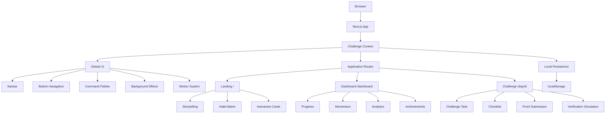

<div align="center">

# ⚡ ABTALKS

### 60-DAY CODING CHALLENGE

**BUILD EVERY DAY · SHIP YOUR WORK · MAKE PROGRESS VISIBLE**

<br>

[](https://ab-talk-website-quantumnest-brown.vercel.app/)
[](https://nextjs.org/)
[](https://react.dev/)
[](https://www.typescriptlang.org/)
[](https://tailwindcss.com/)
[](https://motion.dev/)

<br>

> **60 DAYS · 60 BUILDS · ONE DEVELOPER JOURNEY**

</div>

---

## 🌌 What is ABTalks?

**ABTalks 60-Day Challenge** is a mobile-first coding challenge platform designed to help students build a consistent development habit through daily projects, public proof of work, and progress tracking.

Instead of only consuming tutorials, students are encouraged to:

```text
LEARN
  ↓
BUILD
  ↓
COMMIT
  ↓
SHARE
  ↓
SUBMIT PROOF
  ↓
TRACK PROGRESS
  ↓
REPEAT
```

The objective is simple:

> **Turn daily coding into a visible body of work.**

---

## 🚀 Live Product

### 🌐 Live Demo

**[Open ABTalks →](https://ab-talk-website-quantumnest-brown.vercel.app/)**

### Product Routes

| Experience | Route | Preview |
|---|---|---|
| 🏠 Landing Page | `/` | [Open](https://ab-talk-website-quantumnest-brown.vercel.app/) |
| 📊 Student Dashboard | `/dashboard` | [Open](https://ab-talk-website-quantumnest-brown.vercel.app/dashboard) |
| 🎯 Challenge Day | `/day/12` | [Open](https://ab-talk-website-quantumnest-brown.vercel.app/day/12) |

### Route Map

```text
/
/dashboard
/day/12
```

---

# 🎯 Why ABTalks?

Students already have access to thousands of tutorials, courses, and coding resources.

The bigger challenge is:

```text
Inconsistent Practice
        ↓
Tutorial Hell
        ↓
Unfinished Projects
        ↓
Weak Portfolio
        ↓
Little Public Proof
```

ABTalks changes the learning loop:

```text
DAILY CHALLENGE
      ↓
    BUILD
      ↓
   COMMIT
      ↓
    SHARE
      ↓
 SUBMIT PROOF
      ↓
  TRACK GROWTH
      ↓
  NEXT CHALLENGE
```

The platform focuses on **building consistency through action** rather than passive learning.

---

# ✨ Core Features

### 🔥 60-Day Streak

Track daily consistency throughout the challenge.

### ⚡ XP & Rewards

Earn XP for completing daily challenges and progressing through the journey.

### 🧩 60-Day Habit Matrix

A visual representation of completed, current, upcoming, and missed challenge days.

### 🎯 Daily Missions

Each challenge provides a clear objective and a practical thing to build.

### 🐙 GitHub Proof

Students can submit their repository and commit information.

### 💼 LinkedIn Proof

Students can connect their daily build with a public learning post.

### 🌐 Live Deployment

Students can provide a live URL demonstrating their work.

### 📡 Momentum Tracking

A visual progress system that goes beyond a simple streak counter.

### 🏆 Achievements

Milestone-based rewards encourage continued progress.

### 🎮 Command Palette

Fast application navigation and prototype controls through:

```text
⌘ K
```

or:

```text
Ctrl K
```

### 🔔 Notifications

Interactive notification system with unread states and filtering.

### 🎬 Motion Experience

Scroll reveals, spring interactions, magnetic buttons, parallax effects, glass surfaces, and ambient visual effects.

### 📱 Mobile-First

The experience is designed around a **390px mobile viewport** and adapts to larger screens.

---

# 🖥️ Product Experience

## 🏠 Landing Page

The landing page introduces the 60-Day Challenge and explains why daily building matters.

Key experience:

- Futuristic hero section
- Clear challenge positioning
- Scroll-driven storytelling
- Interactive habit visualization
- Progress and momentum sections
- Testimonials
- FAQ
- Strong challenge CTA

**[Explore Landing Page →](https://ab-talk-website-quantumnest-brown.vercel.app/)**

---

## 📊 Student Dashboard

The dashboard acts as the student's personal coding command center.

It brings together:

```text
Current Streak
      +
XP
      +
Today's Mission
      +
60-Day Progress
      +
Momentum
      +
Achievements
```

**[Open Dashboard →](https://ab-talk-website-quantumnest-brown.vercel.app/dashboard)**

---

## 🎯 Challenge Day

A dedicated experience for completing one challenge.

Example:

```text
/day/12
```

The student can:

1. Read the challenge
2. Understand the objective
3. Complete the task
4. Follow the checklist
5. Submit GitHub proof
6. Submit LinkedIn proof
7. Add live deployment
8. Submit the challenge
9. Receive the simulated verification result
10. Earn XP and update progress

**[Open Day 12 →](https://ab-talk-website-quantumnest-brown.vercel.app/day/12)**

---

# 🔄 Daily Challenge Flow

```text
┌──────────────────────┐
│   TODAY'S MISSION    │
└──────────┬───────────┘
           ↓
┌──────────────────────┐
│   UNDERSTAND TASK    │
└──────────┬───────────┘
           ↓
┌──────────────────────┐
│        BUILD         │
└──────────┬───────────┘
           ↓
┌──────────────────────┐
│    GITHUB COMMIT     │
└──────────┬───────────┘
           ↓
┌──────────────────────┐
│    SHARE LEARNING    │
└──────────┬───────────┘
           ↓
┌──────────────────────┐
│     SUBMIT PROOF     │
└──────────┬───────────┘
           ↓
┌──────────────────────┐
│   VERIFY / AUDIT     │
└──────────┬───────────┘
           ↓
┌──────────────────────┐
│       +150 XP        │
└──────────┬───────────┘
           ↓
┌──────────────────────┐
│    STREAK UPDATED    │
└──────────┬───────────┘
           ↓
        NEXT DAY
```

---

# 🧩 60-Day Habit Matrix

The challenge is represented through a 60-day visual progress system.

```text
01 ✓   02 ✓   03 ✓   04 ✓   05 ✓   06 ✓

07 ✓   08 ✓   09 ✓   10 ✓   11 ✓   12 ●

13     14     15     16     17     18

19     20     21     22     23     24

25     26     27     28     29     30

31     32     33     34     35     36

37     38     39     40     41     42

43     44     45     46     47     48

49     50     51     52     53     54

55     56     57     58     59     60
```

The interface communicates:

- ✓ Completed
- ● Current
- Upcoming
- Missed
- Locked

---

# 📡 Momentum

A streak tells a student:

> **How long have I continued?**

ABTalks also explores:

> **How strong is my current progress?**

The prototype visualizes momentum using signals such as:

```text
Consistency Health
GitHub Activity
Learning Velocity
Proof of Work
```

Example dashboard state:

```text
        MOMENTUM

           87%

Consistency Health     94%
GitHub Activity        89%
Learning Velocity      85%
Proof of Work          92%
```

---

# 🏆 XP & Achievements

Completing a challenge triggers a reward flow.

```text
MISSION COMPLETE

      +150 XP

   🔥 STREAK +1

   🏆 ACHIEVEMENT
```

Example milestones:

```text
🚀 First Build
🔥 7-Day Streak
⚡ Speed Coder
💻 GitHub Builder
🌙 Night Owl
🏆 30-Day Builder
👑 60-Day Finisher
```

---

# 🤖 Proof of Work

ABTalks is built around the idea that **building should create evidence of ability**.

A daily submission can include:

```text
GitHub Repository
       +
Git Commit
       +
LinkedIn Post
       +
Live Deployment
       +
Screenshot / Proof
```

The current MVP validates the submitted information on the client side.

---

# 🧠 Verification Experience

The challenge submission includes a simulated audit flow:

```text
SUBMISSION RECEIVED
        ↓
Connecting Scanner...
        ↓
Checking Commit...
        ↓
Auditing Code...
        ↓
Checking Proof...
        ↓
VERIFICATION COMPLETE
        ↓
+150 XP
        ↓
STREAK UPDATED
```

> **Note:** Verification and AST analysis are currently simulated frontend workflows. Real GitHub API verification and server-side analysis are part of the future roadmap.

---

# 🎬 Motion & Interaction

ABTalks uses motion to communicate interaction and progress rather than using animation purely as decoration.

The interface includes:

- Scroll reveals
- Spring animations
- Magnetic buttons
- Parallax movement
- Animated background effects
- Glassmorphism
- Hover states
- Progress transitions
- Completion animations
- Responsive navigation transitions

Core motion components include:

```text
CustomCursor
MagneticButton
ScrollProgress
ScrollRevealText
StickyStory
```

---

# 📱 Mobile-First Design

ABTalks is designed primarily for students using their phones.

Primary target:

```text
390px
```

The responsive system adapts to:

```text
320px
360px
375px
390px
393px
412px
430px
768px
1024px
1280px+
```

Mobile-specific considerations include:

- Touch-friendly controls
- Floating bottom navigation
- Responsive cards
- Single-column layouts
- Responsive challenge forms
- Compact navigation
- Safe-area spacing
- Reduced visual effects where appropriate

---

# 🏗️ Architecture



---

# 🛠️ Technology Stack

| Technology | Purpose |
|---|---|
| **Next.js 16** | Application framework & routing |
| **React 19** | UI development |
| **TypeScript** | Type-safe development |
| **Tailwind CSS 4** | Styling |
| **Framer Motion** | Animation & interaction |
| **Lucide React** | Interface icons |
| **React Hook Form** | Form handling |
| **HTML5 Canvas** | Ambient background effects |
| **React Context API** | Global state |
| **localStorage** | Client-side persistence |
| **ESLint** | Code quality |
| **Vercel** | Deployment |

---

# 🧱 Project Structure

```text
AB-Talk-Website/
│
├── public/
│
├── src/
│   │
│   ├── app/
│   │   ├── dashboard/
│   │   │   └── page.tsx
│   │   │
│   │   ├── day/
│   │   │   └── [id]/
│   │   │       └── page.tsx
│   │   │
│   │   ├── globals.css
│   │   ├── layout.tsx
│   │   └── page.tsx
│   │
│   ├── components/
│   │   │
│   │   ├── motion/
│   │   │   ├── CustomCursor.tsx
│   │   │   ├── MagneticButton.tsx
│   │   │   ├── ScrollProgress.tsx
│   │   │   ├── ScrollRevealText.tsx
│   │   │   └── StickyStory.tsx
│   │   │
│   │   └── shared/
│   │       ├── BackgroundEffect.tsx
│   │       ├── BottomNav.tsx
│   │       ├── CommandPalette.tsx
│   │       └── Navbar.tsx
│   │
│   └── context/
│       └── ChallengeContext.tsx
│
├── AGENTS.md
├── CLAUDE.md
├── eslint.config.mjs
├── next.config.ts
├── package.json
├── package-lock.json
├── postcss.config.mjs
├── README.md
├── tsconfig.json
└── next-env.d.ts
```

---

# 💾 State Management

The current MVP is intentionally frontend-first and does not require a production database.

```text
React Context
      ↓
ChallengeContext
      ↓
Application State
      ↓
localStorage
```

Current persistence includes:

```text
abtalks_xp
abtalks_streak
abtalks_completed
abtalks_submission
```

This allows the prototype to preserve challenge progress between browser sessions.

---

# 🧪 Edge-Case Support

The prototype includes states for testing realistic scenarios:

```text
New Student
No Streak
Missed Day
Empty Profile
Loading
Offline
```

This helps validate how the interface behaves beyond the ideal success path.

---

# ⚡ Performance

Because ABTalks uses significant visual motion, performance is treated as part of the experience.

The implementation uses:

- GPU-friendly transforms
- Opacity-based animations
- `requestAnimationFrame`
- Canvas rendering
- Framer Motion
- Responsive effects
- Reduced-motion support
- Mobile-specific optimization

Design principle:

> **Make it feel animated, not slow.**

---

# ♿ Accessibility

The interface supports:

- Semantic HTML
- Keyboard navigation
- ARIA labels
- Focus states
- Touch-friendly interactions
- Reduced-motion preferences
- Keyboard command palette
- Escape-key dismissal

---

# ⚠️ MVP Scope

ABTalks is currently a **frontend MVP / functional prototype**.

### Implemented

- Landing page
- Student dashboard
- Challenge experience
- 60-day progress system
- Streak tracking
- XP system
- Achievements
- Momentum visualization
- Proof submission interface
- Command palette
- Notifications
- Responsive navigation
- Mobile-first layouts
- Client-side persistence
- Edge-case simulation

### Not yet connected

- Production authentication
- Production database
- Backend API
- Real GitHub verification
- GitHub webhooks
- Real LinkedIn verification
- Server-side code analysis
- Recruiter dashboard
- Production submission storage

These are intentionally outside the current MVP scope.

---

# 🛣️ Roadmap

### Phase 1 — MVP

- [x] Landing Experience
- [x] Student Dashboard
- [x] Challenge Experience
- [x] 60-Day Matrix
- [x] Streak System
- [x] XP System
- [x] Achievement System
- [x] Momentum System
- [x] Proof Submission
- [x] Responsive UI
- [x] Mobile Navigation
- [x] Local Persistence

### Phase 2 — Real Accounts

- [ ] Authentication
- [ ] Student Profiles
- [ ] GitHub OAuth
- [ ] Persistent User Accounts

### Phase 3 — Backend

- [ ] API
- [ ] PostgreSQL
- [ ] Challenge Database
- [ ] Submission Storage
- [ ] Server-side Progress Engine

### Phase 4 — Verification

- [ ] GitHub API
- [ ] Commit Verification
- [ ] GitHub Webhooks
- [ ] Deployment Verification
- [ ] Real Code Analysis
- [ ] LinkedIn Verification

### Phase 5 — Expansion

Potential challenge tracks:

```text
Frontend
Backend
Full Stack
Python
AI Agents
Flutter
DevOps
Open Source
```

---

# 🎓 Product Philosophy

ABTalks is built around a simple principle:

```text
Learning
   ↓
Practice
   ↓
Building
   ↓
Shipping
   ↓
Proof
   ↓
Growth
```

The goal is not simply to help students **finish a challenge**.

The goal is to help them finish with something they can actually show.

> **Don't just say you can build. Build something that proves it.**

---

# 👥 Team

<div align="center">

### Krishna Porwal · Vaibhav Arora · Lakshay Gupta

**Student Developers · AI Explorers · Practical Builders**

</div>

We are focused on learning through building real-world products, exploring AI and modern web technologies, and turning ideas into working experiences.

---

# ⚙️ Getting Started

## Prerequisites

```text
Node.js 18.17+
npm 9+
Git
```

Check your environment:

```bash
node -v
npm -v
git --version
```

---

## Clone the Repository

```bash
git clone YOUR_GITHUB_REPOSITORY_URL
cd AB-Talk-Website
```

---

## Install Dependencies

```bash
npm install
```

---

## Start Development

```bash
npm run dev
```

Then open:

```text
http://localhost:3000
```

---

## Production Build

```bash
npm run build
```

Start the production server:

```bash
npm run start
```

---

## Lint

```bash
npm run lint
```

---

# ☁️ Deployment

The project is optimized for deployment on **Vercel**.

Current deployment:

**https://ab-talk-website-quantumnest-brown.vercel.app/**

Typical deployment flow:

```text
GitHub
   ↓
Vercel
   ↓
Next.js Build
   ↓
Production Deployment
```

---

# 🔗 Important Links

| Resource | Link |
|---|---|
| 🌐 Live Website | https://ab-talk-website-quantumnest-brown.vercel.app/ |
| 🏠 Landing | https://ab-talk-website-quantumnest-brown.vercel.app/ |
| 📊 Dashboard | https://ab-talk-website-quantumnest-brown.vercel.app/dashboard |
| 🎯 Day 12 | https://ab-talk-website-quantumnest-brown.vercel.app/day/12 |

---

<div align="center">

# ⚡ BUILD · SHIP · SHARE · GROW

### ABTalks — 60-Day Coding Challenge

**60 DAYS · 60 BUILDS · ONE DEVELOPER JOURNEY**

<br>

[🚀 Open Live Demo](https://ab-talk-website-quantumnest-brown.vercel.app/)

</div>

---

### 📄 License

Copyright © 2026 ABTalks.

All rights reserved.

This repository represents the current ABTalks product prototype.

---
