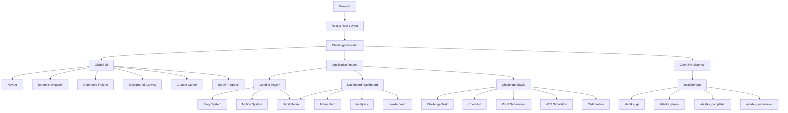

<!-- ========================================================= -->
<!--                    ABTALKS README                         -->
<!-- ========================================================= -->

<div align="center">

# ⚡ ABTALKS

### 60-DAY CODING CHALLENGE

**BUILD EVERY DAY. SHIP YOUR WORK. MAKE YOUR PROGRESS VISIBLE.**

<br />


</div>

---

<div align="center">

## `LEARN → BUILD → COMMIT → SHARE → PROVE → REPEAT`

</div>

---

# 🌌 What is ABTalks?

**ABTalks 60-Day Challenge** is a futuristic, gamified coding platform designed to help student developers turn daily coding into a consistent habit and a visible portfolio of real work.

The core idea is simple:

> **Don't just learn code. Build proof that you can build.**

Instead of spending months consuming tutorials, students complete a structured challenge every day.

Each day encourages the student to:

- 💻 Build something
- 🐙 Commit the work to GitHub
- 💼 Share the learning on LinkedIn
- 🌐 Deploy the project
- 📸 Submit proof of work
- ⚡ Earn XP
- 🔥 Maintain a streak
- 🏆 Unlock achievements
- 📊 Track progress
- 🚀 Build a public developer identity

---

# 🧠 The Problem

Modern students have access to more learning resources than ever.

The problem isn't always **access to knowledge**.

The problem is **consistency and proof**.

A common learning cycle looks like:

```text
Tutorial
   ↓
Notes
   ↓
Another Tutorial
   ↓
Small Practice
   ↓
Abandoned Project
   ↓
Start Again
```

ABTalks changes the loop:

```text
Learn
  ↓
Build
  ↓
Commit
  ↓
Share
  ↓
Submit Proof
  ↓
Get Feedback
  ↓
Earn XP
  ↓
Maintain Streak
  ↓
Build Portfolio
  ↓
Repeat
```

The goal is to transform:

**Learning → Building**

and eventually:

**Building → Proof → Opportunity**

---

# 🚀 Product Vision

ABTalks is designed around one question:

> **What if a student's 60 days of coding could become their strongest proof of ability?**

At the end of the challenge, the student should not only have:

```text
60 days completed
```

but ideally:

```text
60 builds
+
GitHub commits
+
Public learning posts
+
Deployments
+
Proof of work
+
Developer habits
```

That becomes a much stronger developer story than a list of completed courses.

---

# ✨ Core Experience

## 01 — Landing Page

### `/`

The landing page is the first experience for a student who has never heard of ABTalks.

It communicates:

- What ABTalks is
- Why the 60-day challenge exists
- How the challenge works
- What students build
- Why public proof matters
- How progress is tracked
- Why consistency matters

The experience uses:

- Cinematic hero section
- Scroll-driven storytelling
- Sticky story chapters
- Animated typography
- Parallax visuals
- Glassmorphism
- Neon lighting
- Interactive cards
- Motion transitions
- Testimonials
- FAQ modules
- Calls to action

---

## 02 — Student Dashboard

### `/dashboard`

The dashboard acts as the student's personal developer command center.

It includes:

```text
🔥 Current Streak

⚡ Total XP

📡 Momentum

🎯 Today's Mission

🧩 60-Day Habit Matrix

📊 Weekly Coding Activity

🏆 Achievements

👥 Cohort Standing
```

The dashboard is designed to answer three questions immediately:

> **Where am I?**

> **What do I need to build today?**

> **How am I progressing?**

---

## 03 — Challenge Day

### `/day/[id]`

The challenge page represents the complete experience of a single challenge day.

Example:

### `/day/12`

The student can:

- Read the challenge
- Understand the objective
- Review requirements
- Complete the checklist
- Submit GitHub repository
- Submit commit/diff
- Submit LinkedIn post
- Submit live deployment
- Upload proof
- Submit the challenge
- Receive simulated verification
- Claim XP
- Update streak

---

# 🎯 The Daily Challenge Loop

```text
┌─────────────────────┐
│   TODAY'S MISSION   │
└──────────┬──────────┘
           ↓
┌─────────────────────┐
│   UNDERSTAND TASK   │
└──────────┬──────────┘
           ↓
┌─────────────────────┐
│       BUILD         │
└──────────┬──────────┘
           ↓
┌─────────────────────┐
│    GITHUB COMMIT    │
└──────────┬──────────┘
           ↓
┌─────────────────────┐
│   SHARE ON LINKEDIN │
└──────────┬──────────┘
           ↓
┌─────────────────────┐
│    SUBMIT PROOF     │
└──────────┬──────────┘
           ↓
┌─────────────────────┐
│    VERIFY / AUDIT   │
└──────────┬──────────┘
           ↓
┌─────────────────────┐
│     +150 XP ⚡      │
└──────────┬──────────┘
           ↓
┌─────────────────────┐
│   STREAK UPDATED 🔥 │
└──────────┬──────────┘
           ↓
        NEXT DAY
```

---

# 🖥️ Product Screens

## 🏠 Landing Page

<p align="center">
  
</p>

---

## 📊 Student Dashboard

<p align="center">
  
</p>

---

## 🎯 Challenge Day

<p align="center">
  
</p>

> **Tip:** Replace these three images with screenshots captured from your actual deployed website. Real product screenshots make the README much stronger than generic stock images.

---

# 🔥 Feature Overview

| Feature | Description |
|---|---|
| 🔥 60-Day Streak | Tracks daily coding consistency |
| ⚡ XP Engine | Rewards challenge completion |
| 🏆 Achievements | Unlocks milestone rewards |
| 🧩 Habit Matrix | Visualizes all 60 challenge days |
| 📡 Momentum | Measures progress beyond a simple streak |
| 🐙 GitHub Proof | Repository and commit submission |
| 💼 LinkedIn Proof | Public learning submission |
| 🌐 Live Deployment | Deployment URL submission |
| 🤖 AST Audit | Simulated code-quality verification |
| 🎮 Command Palette | Keyboard-driven application controls |
| 🔔 Notifications | Interactive notification system |
| 📊 Analytics | Weekly coding activity visualization |
| 👥 Leaderboard | Cohort standing |
| 📱 Mobile First | Designed for small-screen usage |
| 🧪 Edge Cases | Offline, missed day, empty profile and more |

---

# 📡 Momentum Telemetry

A traditional streak answers:

> **How long have you continued?**

ABTalks introduces another question:

> **How strong is your current momentum?**

The prototype visualizes momentum using multiple signals:

```text
                    MOMENTUM

                      87%

        ┌──────────────────────────┐
        │                          │
        │  Consistency Health  94% │
        │  GitHub Activity     89% │
        │  Learning Velocity   85% │
        │  Proof of Work       92% │
        │                          │
        └──────────────────────────┘
```

This creates a broader progress signal than a simple streak counter.

---

# 🧩 60-Day Habit Matrix

The challenge is represented as a visual 60-day journey.

```text
01 ✓   02 ✓   03 ✓   04 ✓   05 ✓   06 ✓

07 ✓   08 ✓   09 ✓   10 ✓   11 ✓   12 ●

13     14     15     16     17     18

19     20     21     22     23     24

25     26     27     28     29     30

31     32     33     34     35     36

37     38     39     40     41     42

43     44     45     46     47     48

49     50     51     52     53     54

55     56     57     58     59     60
```

Node states communicate:

- 🟢 Completed
- ⚪ Current
- 🔵 Upcoming
- 🔴 Missed
- 🔒 Locked

The goal is to make progress visually obvious.

---

# 🏆 XP & Achievement System

Completing a challenge rewards the student.

Example:

```text
MISSION COMPLETE

+150 XP

🔥 STREAK +1

🏆 ACHIEVEMENT CHECK
```

Potential milestones include:

```text
🚀 First Build
🔥 7-Day Streak
⚡ Speed Coder
💻 GitHub Builder
🌙 Night Owl
🏆 30-Day Warrior
👑 60-Day Legend
```

---

# 🤖 Proof-of-Work System

ABTalks is built around the concept of **visible proof**.

A student can submit:

```text
GitHub Repository
        +
Git Commit / Diff
        +
LinkedIn Post
        +
Live Deployment
        +
Screenshot
        +
Learning Notes
```

The current prototype validates these inputs on the client side.

---

# 🧠 Simulated Verification

The challenge completion flow includes a simulated audit experience.

```text
SUBMISSION RECEIVED
        ↓
Connecting AST Scanner...
        ↓
Checking Git Commit...
        ↓
Auditing Code Quality...
        ↓
Checking Proof of Work...
        ↓
Verification Complete ✓
        ↓
+150 XP
        ↓
STREAK UPDATED
```

### Important

The current AST scanner is a **frontend simulation**.

Real GitHub API verification, webhooks and production code analysis are planned for future versions.

---

# 🎮 Command Palette

The application includes a global command palette.

### macOS

```text
⌘ + K
```

### Windows / Linux

```text
Ctrl + K
```

The command palette provides:

- Navigation
- Challenge shortcuts
- Simulation controls
- XP testing
- Achievement testing
- Application actions

Keyboard support:

```text
↑      Navigate
↓      Navigate
Enter  Execute
Esc    Close
```

---

# 🔔 Notification System

The global navigation includes an interactive notification drawer.

Features:

- Notification list
- Read / unread state
- Unread counter
- Filter tabs
- Mark all as read
- Responsive mobile drawer

---

# 🎬 Motion System

Motion is not used only as decoration.

It is used to communicate:

- Progress
- Hierarchy
- Interaction
- State changes
- Completion
- Navigation

The application uses:

```text
Framer Motion
      +
CSS Animations
      +
HTML5 Canvas
      +
Scroll Transforms
      +
Spring Physics
```

Implemented motion components include:

```text
CustomCursor
MagneticButton
ScrollProgress
ScrollRevealText
StickyStory
```

---

# 🌌 Visual Language

ABTalks follows a futuristic developer-console aesthetic.

### Design Keywords

```text
Futuristic
Dark
Cinematic
Glassmorphic
Neon
Developer-focused
Minimal
Interactive
Mobile-first
```

---

# 🎨 Color System

### Background

```text
Obsidian
#050505

Dim Dark
#08090B

Glass
rgba(11, 13, 16, 0.65)
```

### Primary Accents

```text
Electric Purple
#6C63FF

Indigo
#7C3AED

Violet
#8B5CF6
```

### Secondary Accents

```text
Cyan
#06B6D4

Teal
#14B8A6
```

### Status

```text
Orange
#F97316

Emerald
#10B981

Gold
#FBBF24

Rose
#F43F5E
```

---

# ✍️ Typography

### Headings

**Outfit**

Used for:

- Hero headings
- Major statements
- Statistics
- Section titles

### UI / Body

**Plus Jakarta Sans**

Used for:

- Navigation
- Cards
- Forms
- Dashboard
- Descriptions

### Technical UI

Monospace typography is used for:

- Developer labels
- Telemetry
- Code indicators
- System states

---

# 📱 Mobile-First Design

ABTalks is specifically designed for students who may use the platform:

> **late at night, after college, primarily from their phones.**

Primary mobile target:

```text
390px
```

Tested design targets:

```text
320px
360px
375px
390px
393px
412px
430px
768px
1024px
1280px+
```

Mobile experience includes:

- Compact navigation
- Floating bottom navigation
- Touch-friendly controls
- Responsive cards
- Single-column dashboard
- Responsive 60-day matrix
- Mobile submission forms
- Safe-area handling
- Reduced visual effects
- Mobile-specific navigation composition

---

# 🏗️ System Architecture



---

# 🧱 Component Architecture

```text
src/
│
├── app/
│   ├── layout.tsx
│   ├── page.tsx
│   ├── globals.css
│   │
│   ├── dashboard/
│   │   └── page.tsx
│   │
│   └── day/
│       └── [id]/
│           └── page.tsx
│
├── components/
│   │
│   ├── motion/
│   │   ├── CustomCursor.tsx
│   │   ├── MagneticButton.tsx
│   │   ├── ScrollProgress.tsx
│   │   ├── ScrollRevealText.tsx
│   │   └── StickyStory.tsx
│   │
│   └── shared/
│       ├── BackgroundEffect.tsx
│       ├── BottomNav.tsx
│       ├── CommandPalette.tsx
│       └── Navbar.tsx
│
└── context/
    └── ChallengeContext.tsx
```

---

# 🛠️ Tech Stack

| Technology | Role |
|---|---|
| **Next.js 16.3** | Framework & routing |
| **React 19** | UI architecture |
| **TypeScript 5** | Type safety |
| **Tailwind CSS 4** | Utility styling |
| **Framer Motion 13** | Motion & physics |
| **Lucide React** | Icons |
| **React Hook Form** | Form handling |
| **HTML5 Canvas** | Background effects |
| **React Context API** | Global state |
| **localStorage** | Browser persistence |
| **ESLint 9** | Code quality |
| **npm** | Package management |
| **Vercel** | Deployment target |

---

# 💾 State Management

The current MVP intentionally operates without a production backend.

```text
React Context
      ↓
ChallengeContext
      ↓
Application State
      ↓
Browser localStorage
```

Current storage keys:

```text
abtalks_xp

abtalks_streak

abtalks_completed

abtalks_submission
```

### Example

```text
abtalks_xp
→ Integer

abtalks_streak
→ Current streak

abtalks_completed
→ Completed challenge days

abtalks_submission
→ Submission metadata
```

---

# 🧪 Edge-Case Simulation

The application contains simulation states for testing real-world scenarios.

```text
isOffline
isLoading
isEmptyProfile
hasNoStreak
hasMissedDay
```

This allows the product to be tested as:

```text
New Student
    ↓
First Day
    ↓
Active Streak
    ↓
Missed Day
    ↓
Recovery
    ↓
Challenge Completion
```

without requiring a production backend.

---

# 🗺️ Route Map

| Route | Purpose |
|---|---|
| `/` | Landing page |
| `/dashboard` | Student dashboard |
| `/day/[id]` | Dynamic challenge page |
| `/day/12` | Example challenge |

### Required evaluation routes

```text
/
/dashboard
/day/12
```

---

# 📂 Project Structure

```text
AB-Talk-Website/
│
├── public/
│   ├── file.svg
│   ├── globe.svg
│   ├── next.svg
│   ├── vercel.svg
│   └── window.svg
│
├── docs/
│   └── screenshots/
│       ├── landing.png
│       ├── dashboard.png
│       └── challenge.png
│
├── src/
│   │
│   ├── app/
│   │   ├── dashboard/
│   │   │   └── page.tsx
│   │   │
│   │   ├── day/
│   │   │   └── [id]/
│   │   │       └── page.tsx
│   │   │
│   │   ├── favicon.ico
│   │   ├── globals.css
│   │   ├── layout.tsx
│   │   └── page.tsx
│   │
│   ├── components/
│   │   │
│   │   ├── motion/
│   │   │   ├── CustomCursor.tsx
│   │   │   ├── MagneticButton.tsx
│   │   │   ├── ScrollProgress.tsx
│   │   │   ├── ScrollRevealText.tsx
│   │   │   └── StickyStory.tsx
│   │   │
│   │   └── shared/
│   │       ├── BackgroundEffect.tsx
│   │       ├── BottomNav.tsx
│   │       ├── CommandPalette.tsx
│   │       └── Navbar.tsx
│   │
│   └── context/
│       └── ChallengeContext.tsx
│
├── AGENTS.md
├── CLAUDE.md
├── eslint.config.mjs
├── next.config.ts
├── package.json
├── package-lock.json
├── postcss.config.mjs
├── README.md
├── tsconfig.json
└── next-env.d.ts
```

---

# ⚙️ Getting Started

## Requirements

Make sure the following are installed:

```text
Node.js 18.17+
npm 9+
Git
```

Check versions:

```bash
node -v
npm -v
git --version
```

---

## Clone

```bash
git clone YOUR_GITHUB_REPOSITORY_URL
```

Then enter the project directory:

```bash
cd AB-Talk-Website
```

---

## Install

```bash
npm install
```

---

## Development

```bash
npm run dev
```

Open the application at:

```text
http://localhost:3000
```

---

# 🌐 Routes

### Landing

```text
/
```

### Dashboard

```text
/dashboard
```

### Challenge

```text
/day/12
```

---

# 🏭 Production Build

Create a production build:

```bash
npm run build
```

Start production mode:

```bash
npm run start
```

---

# 🧹 Lint

Run:

```bash
npm run lint
```

---

# ☁️ Deployment

ABTalks is designed for deployment on Vercel.

Deployment flow:

```text
GitHub
   ↓
Vercel
   ↓
Detect Next.js
   ↓
Install Dependencies
   ↓
next build
   ↓
Deploy
```

No production environment variables are currently required for the frontend MVP.

---

# ⚡ Performance

ABTalks contains a significant amount of animation and visual effects.

Performance is therefore treated as a core product requirement.

The implementation uses:

- GPU-friendly transforms
- Opacity-based transitions
- `requestAnimationFrame`
- HTML5 Canvas
- Framer Motion
- Responsive animation
- Reduced-motion support
- Component-level motion
- Mobile-specific optimization

### Design principle

> **Make it feel animated, not slow.**

Heavy visual effects are reduced on smaller screens where appropriate.

---

# ♿ Accessibility

The application includes:

- Semantic HTML
- Keyboard navigation
- ARIA labels
- Accessible controls
- Focus states
- Touch-friendly interactions
- Reduced-motion support
- Keyboard command palette
- Escape-key dismissal

Motion can be reduced using:

```text
prefers-reduced-motion
```

---

# 🔐 Security

The current MVP contains:

- No private API keys
- No database passwords
- No authentication secrets
- No private tokens

External links are configured with secure target handling.

User-submitted URLs are validated before the submission workflow proceeds.

---

# 🗄️ Backend Status

The current version is intentionally frontend-first.

### Current

```text
React
   ↓
Context API
   ↓
localStorage
```

### Not currently connected

```text
❌ Production API
❌ Production Database
❌ Authentication
❌ GitHub Webhooks
❌ LinkedIn API
❌ Server-side verification
```

This allows the complete product experience to be demonstrated without requiring backend infrastructure.

---

# ⚠️ Current Limitations

ABTalks is currently a:

> **Frontend MVP / Functional Prototype**

The following systems are simulated:

### Authentication

User profiles are simulated.

### AST Verification

The scanner is a frontend simulation.

### Proof Verification

GitHub and LinkedIn URLs are validated client-side.

### Database

No production database is connected.

### Recruiter Platform

Recruiter-facing infrastructure is not currently implemented.

### Automated Testing

A dedicated automated testing framework is not currently configured.

---

# 🛣️ Roadmap

## Phase 01 — Frontend MVP

- [x] Landing Page
- [x] Dashboard
- [x] Challenge Page
- [x] 60-Day Matrix
- [x] Streak Engine
- [x] XP System
- [x] Achievement System
- [x] Momentum System
- [x] Proof Submission
- [x] Command Palette
- [x] Notifications
- [x] Mobile Navigation
- [x] Responsive Layout
- [x] Edge-Case Simulation
- [x] localStorage Persistence

---

## Phase 02 — Authentication

- [ ] GitHub OAuth
- [ ] LinkedIn Authentication
- [ ] Email Authentication
- [ ] Student Profiles
- [ ] Secure Sessions
- [ ] Account Recovery

---

## Phase 03 — Backend

- [ ] Production API
- [ ] PostgreSQL
- [ ] User Database
- [ ] Challenge Database
- [ ] Submission Storage
- [ ] Server-side Streak Engine
- [ ] Achievement Persistence

---

## Phase 04 — Real Verification

- [ ] GitHub API
- [ ] Commit Verification
- [ ] GitHub Webhooks
- [ ] Repository Verification
- [ ] LinkedIn Verification
- [ ] Deployment Verification
- [ ] Real AST / Code Analysis

---

## Phase 05 — Learning Tracks

Future tracks:

```text
Frontend Engineering
Backend Engineering
Full Stack
Python
AI Agents
Flutter
Open Source
DevOps
```

---

## Phase 06 — Recruiter Ecosystem

Long-term vision:

```text
Student
   ↓
Verified Projects
   ↓
Coding Consistency
   ↓
Skill Signals
   ↓
Proof of Work
   ↓
Developer Profile
   ↓
Recruiter Discovery
```

The long-term goal is to help recruiters discover students based on **demonstrated ability**, not only resumes.

---

# 🌟 What Makes ABTalks Different?

Traditional learning platforms often focus on:

```text
COURSES
VIDEOS
QUIZZES
CERTIFICATES
```

ABTalks focuses on:

```text
BUILD
SHIP
PROVE
SHARE
REPEAT
```

The platform is designed to transform:

```text
Learning
   ↓
Practice
   ↓
Projects
   ↓
Proof
   ↓
Developer Identity
```

A student should finish the challenge with more than a number.

They should finish with a story:

> **"Here is what I built."**

---

# 📈 Success Loop

```text
       ┌─────────────┐
       │    LEARN    │
       └──────┬──────┘
              ↓
       ┌─────────────┐
       │    BUILD    │
       └──────┬──────┘
              ↓
       ┌─────────────┐
       │    SHIP     │
       └──────┬──────┘
              ↓
       ┌─────────────┐
       │    PROVE    │
       └──────┬──────┘
              ↓
       ┌─────────────┐
       │    SHARE    │
       └──────┬──────┘
              ↓
       ┌─────────────┐
       │   REFLECT   │
       └──────┬──────┘
              ↓
       ┌─────────────┐
       │   REPEAT    │
       └──────┬──────┘
              │
              └──────────────→ LEARN
```

---

# 📊 Current Project Status

```text
╔══════════════════════════════════════════════╗
║              ABTALKS MVP STATUS              ║
╠══════════════════════════════════════════════╣
║                                              ║
║  Frontend             ██████████  100%       ║
║  UI / UX              ██████████  100%       ║
║  Motion System        ██████████  100%       ║
║  Challenge Flow       ██████████  100%       ║
║  Local Persistence    ██████████  100%       ║
║  Responsive UI       ██████████  100%       ║
║                                              ║
║  Backend              ░░░░░░░░░░    0%       ║
║  Authentication       ░░░░░░░░░░    0%       ║
║  Real Verification    ░░░░░░░░░░    0%       ║
║                                              ║
╚══════════════════════════════════════════════╝
```

**Status:** 🟢 Active Frontend MVP

---

# 🧑‍💻 Author

<div align="center">

## Krishna Porwal || Vaibhav arora || lakshay gupta

### Student Developer • AI Explorer • Practical Builder

**Learning AI + Web Development By Doing**

</div>

Areas of interest:

```text
Artificial Intelligence
Web Development
React
Next.js
Agentic AI
Software Engineering
Developer Tools
Product Building
Learning by Building
```

### Developer Philosophy

> **I don't want to become a developer who only knows syntax.**
>
> **I want to become a builder who knows how to solve real problems.**

---

# ⚡ ABTalks in One Sentence

> **ABTalks turns 60 days of daily coding into a visible journey of projects, proof, consistency and developer growth.**

---

# 🌌 Final Thought

```text
You don't need another tutorial.

You need another build.

One build becomes a streak.

A streak becomes a habit.

A habit becomes a portfolio.

A portfolio becomes proof.

And proof gets noticed.

       ┌───────────────────────────┐
       │                           │
       │      BUILD EVERY DAY      │
       │                           │
       │       SHIP YOUR WORK      │
       │                           │
       │   MAKE PROGRESS VISIBLE   │
       │                           │
       └───────────────────────────┘

                 ⚡ ABTALKS
```

---

<div align="center">

# 🔥 BUILD • SHIP • SHARE • GROW 🔥

### ABTalks — 60-Day Coding Challenge

<br />

**60 DAYS · 60 BUILDS · ONE DEVELOPER JOURNEY**

<br />

⭐ **If you like the project, consider starring the repository.**

</div>

---

## 📄 License

Copyright © ABTalks.

All rights reserved.

This project is currently maintained as a product prototype / hackathon project.

---
